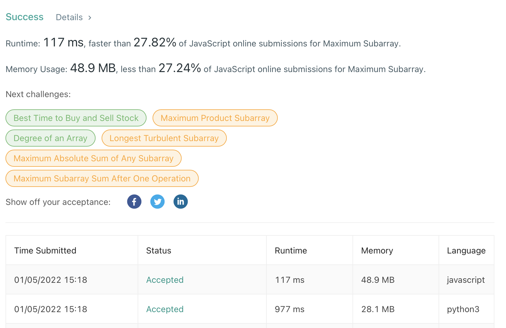

## 
Maximum Subarray

#### 
📚 _LeetCode Problem #53 (**Level Easy**) 01/05/2022_ 

**_
By Daniel Adeyemi_**

---

## 
 🚩 _Description_:

##### **_This is solutions for Leet Code problem [# 53 "Maximum Subarray"](https://leetcode.com/problems/maximum-subarray/)._**

### 
 🤔 Problem description:

Given an integer array nums, find the contiguous subarray (containing at least one number) which has the largest sum and return its sum.

A subarray is a contiguous part of an array.

## 
 🚥 Tests

## 
 🛠️ _Technologies used:_

- Python 3.9
- JavaScript

## 
 🌟 _Teaching points:_

- we can assign current and the biggest sums to a first element of an array
- when we loop we compare current element of an array and current sum plus this element and taking a max out of it
- then we compare current sum with the biggest sum and assign the biggest number as the biggest sum
- this way we only loop once so we have **O(n)** time complexity

## 
 📬 Contact Information

#### For any questions _[email author](mailto:adeyemidany+github@gmail.com?subject=[GitHub])_

## 
 📘 _License and copyright:_

> **_© Daniel Adeyemi, 2022_**  
> ⚖️ __
